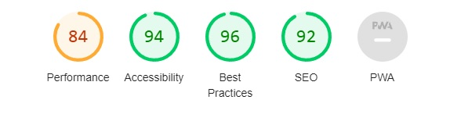
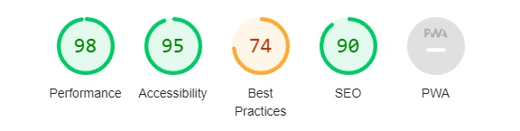
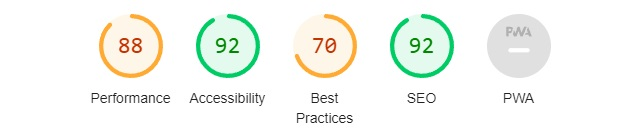
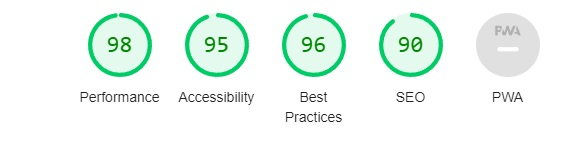
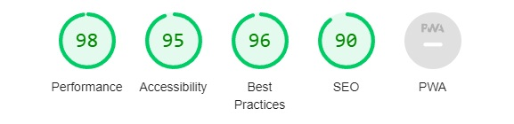
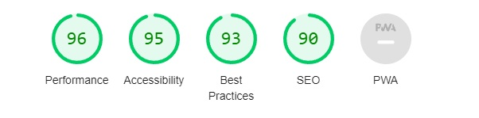
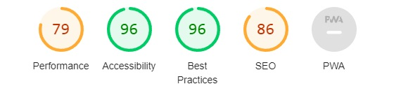
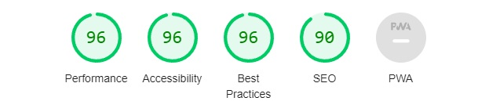

   # Welcome to my fourth project

## HEALTHY YOU - RECIPE SITE

### PURPOSE

---

It's a website for people who are looking for healthy recipes. Maybe you just want to eat better and healthier food, or you want to change your body and mind to be the best version of yourself by training and eating better. As a user you can save your favourite recipes to youre profile and add your own recipes if you like. The site offers a appealing hero image when users first enter the site. The goal is to make people want to stay on the website and get to know more about Healthy You and what the site has to offer. Users can easily navigate to the different pages of the website with the navigation menu at the top. The navigation menu contains a logo which takes the user to the home page if they click on it. It also has six menus: Home, Recipes, About, Contact, Register and Log in if the user isnt logged in to the website. If the user has registered and is logged in he/she can see Add Recipe and Log out insted of Register and Log in.  

### UX DESIGN

---

#### USER STORIES

- #### As a first time user

  - I want to easy find what the website offers
  - I want to navigate easy through the different menus
  - I want to find the links to other social media platform where I can find and search the recipes through other platforms
  - I want to be able to join the website so I easy can find new/saved recipes
  - I want to be able to join the website so I can write my own recipes
  - I want to be able to rate recipes
  - I want to be able to comment on recipes
  
- #### As a returning and frequent user

  - I want to log in and see saved/created recipes
  - I want to see if the website is updated with new recipes
  - I want to be able to update my recipes
  - I want to be able to answer on commented recipes
  - I might want to contact Healthy You if I got any questions
  
#### All users want to be able to scroll through the website on their phones without any disturbing events and easy find what they are looking for

### AGILE METHODS

---

#### KANBAN 

I used github projects to make my own kanban board to be able to keep track on all different steps I needed to take during this project

### STRUCTURE

---

#### HOME PAGE

- The home page welcomes the user to the Health You website. 
- A text informs the user what the websites purpose is.
- The user can click on green links that takes he/she to a specific type of recipe
- The user can also use the search bar at the top right corner to search for specific recipes

  
#### RECIPES PAGE

- Shows all the latest recipes
- The user can click on a specific recipe to see more detail about it
  
#### RECIPE DETAIL PAGE

- The detail page for a recipe
- Shows the name of the recipe, ingridients, steps on how to make the recipe
- The user can choose to edit or delete their own created recipes on this page but needs to be logged in for these functions to show.
- The user can leave a comment on the recipe of they are logged in. Also edit/delete and old comment they have made

#### ABOUT US PAGE

- The About Page explains more about Healthy You and the purpose of the website
  
#### CONTACT PAGE

- The user can choose to contact Healthy You if he/she got any questions with the form on this page

#### REGISTRATION PAGE

- If the user want to join the website to be able to save and create own recipes its done in this page

#### LOG IN PAGE

- If the user want to log in to their own profile and see saved/own recipe its done on this page

#### PROFILE PAGE

- If the user want to see the recipes they have created its done on this page
- The user needs to be logged in to used the feature

#### ADD RECIPE PAGE

- If the user want to add a new recipe its done on this page
- The user needs to be logged in to used the feature

### FEATURES

#### FUTURE FEATURES

My plan in the future is to add the star rating for each recipe so the users can rate the recipes after how good they were. 
Also adding the heart symbol to make each user able to save a recipe they really like to their own profile page. 

---

#### HEADER AND NAVIGATION BAR/MENU

- The header is at the top of the website and contains the logo and the navigation bar/menu. For screens bigger then 1024px you can see all the different navigation menus at the top at the right side of the header logo.
- Users can easy find the websites different pages through the navigation menu where they can go to the Recipes, About, Contact, Register or Log in page. 
- The logo in the top left corner of the navigation bar is also a link to the home page.
- The user can see both the logo and navigation menu easy because of the color scheme of the offwhite background with the green text

- For mobile phones the navigation menu turns into a hamburger bar icon which they can click on to activate the navigation menu

#### HOME PAGE

- #### HERO IMAGE

  - The hero image is one of the first things you notice when you enter the website. The goal is to make the users want to stay and want to search for delicious recipes to make on their own'
  - It also contains some text which explains the purpose of the website and what the user can do

- #### CLICKABLE LINKS

  - The home page also got clickable links under the hero image
  - Each link goes to a different type of food recipes
  - This is to make users want to explore more and easy be able to that directly from the home page 

#### RECIPES PAGE

- Its at the recipes page the user can see all the recipes that is added to the webpage
- The user can press the heart icon to save a recipe to their own profile if they are logged in

- #### RECIPE DETAIL PAGE

  - If the user click on a recipe they are taken to the detail page of that recipe
  - It shows the ingredients, instructions, and any comments that made
  - The user can leave a comment if they are logged in
  - If any user have made a comment they are published at the bottom of the webpage, under the recipe

#### ABOUT PAGE

- The about page describes what the user can do on the Healthy You webpage and what its purpose

#### CONTACT PAGE

- If users needs to contact Healthy You for some reason they can go to the contact page and fill in the form

#### REGISTER PAGE

- If the user want to create a user to be able to create and save/comment on recipe its done on this page

#### LOG IN PAGE

- If the user want to log in to be able to see created or saved recipes and edit their own recipes or comments its done on this page

#### PROFILE PAGE

- If the user want to see their own recipes or recipes that they have liked its done on this page
- The user needs to be logged in for this page to show

#### ADD RECIPE PAGE

- If the user want to add their own recipe to the Healthy You webpage its done on this page
- The user needs to be logged in for this page to show

### COLOR SCHEME

---

- The color on the background of the header and footer is a beautiful off-white #F1EDE1.
- The color of the logo and navigation menu text is green #49892a, to stand out from the off-white background color
- The color of the all buttons is a darker green #198754, to stand out more from the rest of the content. They are first white with a darkgreen text and border, but when hovered over they text turns white and the background turns to dark green
- The main background is white to make the header and footer stand out more from the rest of the content

### TECHNOLOGIES

---

- [https://validator.w3.org/nu/] to validate html code
- [https://jigsaw.w3.org/css-validator/] to validate css code
- Python is valified through CI Python Linter
- used [https://favicon.io/favicon-converter/] to generate the favicon
- Python
- Django
- Bootstrap
- HTML
- CSS
- Javascript
- Cloudinary
- ElephantSQL

### WIREFRAMES

---

#### HOME PAGE

- Changed the text and icons in the footer to be centered
- Decided to remove the recipes to their own page and insted have clickable links for different food type recipes

#### RECIPES PAGE

- Removed the rating function due to not having enough time to finish that part

#### RECIPES DETAIL PAGE

- Added a comment function so a logged in user can comment on the recipe
- Removed the rating function due to not having enough time to finish that part

#### ABOUT PAGE

- Decided to make the image to the left take up the whole height of the webpage to make it look more appealing

#### CONTACT PAGE

- Decided to make the contact page have the same layout as the about page with a picture to the left with a text describing what the user can do on that page. This because i want the webpage to have a similar theme

#### REGISTER PAGE

- Decided to make the log in and register page to have a similar look so the pages follows a similar theme
- Decided to remove the image to the left so the page only got the form left

#### LOG IN PAGE

- Decided to make the log in and register page to have a similar look so the pages follows a similar theme
- Decided to remove the image to the left so the page only got the form left

#### The profile and add recipe pages was made after I had finished the wireframes. They were made when I did the tutorial on Youtube for the webpage. Before that I had in mind to only have a saved recipes page that showed up when the user was logged in insted of a profile page. But quickly realized that I needed more subheadings on the saved recipes page and there for choose to create the profile page insted. Due to not having enough time i choose to delete the save recipes part of the profile and just have the recipes the user has created. 

### TESTING

---

- I tested the website in Chrome, Firefox and Edge browser to see that all pages loaded and that every link, button, form, images and navigation menu was working
- The site is also responsive which I tested in google chromes devtools by selecting different screensizes and test each function
- I tested that all text is easy to read and to understand
- The CSS code got valified through a CSS validator

  
- The HTML code got valified through a HTML validator
  I viewed each pages source code on the live website and copy and pasted that html code to the 
  html validator, so I wouldnt get any django errors. I got some other errors from the live page html code 
  which I couldnt see in the html template code in the IDE:
  - #### RECIPE DETAIL PAGE
  Said that I had stray < p >, < tr >, < td > and < th > tags, which I couldnt find in the html code in the IDE.
  All the other html pages was OK. 

  
- All the Python code is valified through CI Python Linter

  

#### MANUAL TESTING 

I also did manual testings on all website pages to ensure that everything was working as expected:

  - #### HOME PAGE 
  Description:
  Make sure all the links to the 5 different recipe types are working

  Steps:

  1. Go to the home page
  2. Click on each link and see if it takes you to the correct type of recipe
  
  Expected:

  The user should be sent to a recipe containing meat when clicking on the meat link

  Actual:

  I was sent to the recipes page which showed me a recipe with meat in it

- #### HEADER AND NAVIGATION MENU

 Description:
  Make sure all the navigation links and the search bar is working

  Steps:

  1. Click on each navigation link to see that i'm taken to the correct page
  2. Click on the logo at the left corner of the header to see that i'm taken to the home page
  3. Write something in the search bar, for example "meat" to see that im taken to a recipe with meat in it
  
  Expected:

  The user should be taken to the correct page when clicking on a navigation link
  The user should be taken to the correct recipe when using the searchbar, and if no recipes are found the recipes page is showed empty

  Actual:

  I was sent to all correct pages through the navigation links and the searchbar showed me the correct recipes i was searching for

  - #### RECIPES PAGE 

  Description:
  Make sure all the recipes are showed and that the user is taken to the correct recipe when clicking on it

  Steps:

  1. Click on the recipes link in the navigation menu
  2. See that the recipes are showing and then click on one recipe
  3. See that the user is taken to the correct recipe that is clicked on
  
  Expected:

  The user should see all the different recipes when first visiting the recipes page
  The user should be taken to the correct recipe when clicking on one of the recipes

  Actual:

  When I clicked on the recipes link in the navigation menu I was taken to the recipes page. It showed me all the different recipes. 
  I then clicked on all the recipes to see that I was taken to the correct recipe, which I was

- #### RECIPE DETAIL PAGE 

  Description:
  Make sure that the user is taken to the correct recipe detail page, showing the correct information, ingredients, instructions and made comments. 
  If the user has made that recipe / and/ or comment they should  also be able to edit/delete that recipe/comment.
  Make sure that a logged in user can make a comment 

  Steps:

  1. Click on one recipe on the recipes page
  2. See that the correct recipe is showing
  3. Check that all information, ingredients, instructions and comments are showing
  4. Check that the user can edit/delete that recipe if they are the creator of that recipe
  5. Check that the user can edit/delete a made comment if they are the creator of that comment
  6. Check that I can make a comment on a recipe if i'm logged in
  
  Expected:

  The user should see the correct recipe with all the information about it
  The user should be able to edit/delete the recipe/comment if they are the creator
  The user can make a comment if they are logged in at the website. If not logged in a message should tell them to log in to be able to create a comment

  Actual:

  When I clicked on one recipe i was taken to that specific recipe. All the information, ingredients and instructions seemed correct due to the title of the recipe.
  I could also edit/delete both the recipe and comments I had made if I were the creator of those. I could write and post a comment as I was logged in. When I wasnt logged in a got a message under the "Add a comment" title that telled me I had to log in to be able to use that feature

  - #### ABOUT PAGE 

  Description:
  Make sure that the about page is showing the correct image and text 

  Steps:

  1. Click on about link in the navigation menu
  2. See that the user is taken to the about page 
  3. See that the correct text is showing that tells the user about this webpage
  
  Expected:

  The user should be taken to the about page displaying a text describing the purpose about this webpage

  Actual:

  When I clicked on about pages navigation link in the navigation menu I was taken to the correct page, showing me the text describing what this webpage purpose is

- #### CONTACT PAGE 

  Description:
  Make sure that all the different fields in the contact form is working and that the user get a message when the form is successfully sent

  Steps:

  1. Write nothing in each field in the contact form tells you to fill that specific field
  2. Write a number in the first name/ last name fields too see if the form tells you that is wrong
  3. Write a name only in the email field to see that the form tells you that you need a email adress
  4. Write nothing on the message field to see that the form tells you that you need to fill this in

  Expected:

  The user should be informed to fill in each field with the correct information before being able to submit the form

  Actual:

  When I filled in each field correct the form was sent and I got a message telling me "Thank you for your message. We will contact you as soon as possible."

- #### REGISTER PAGE 

  Description:
  Make sure the registration is working and that the user can create their own user at the website

  Steps:

  1. Fill in the email field with a name only and see that the form is telling me to use email adress
  2. Fill in the username and then choose a password the is short and see that its telling me to choose another password
  3. Fill in the username and then choose a password the is only numbers and see that its telling me to choose another password
  4. Fill in the username and then choose a password and write it in a different way in the second field to ensure that the form is telling you that the password needs to be the same
  5. Fill in each field correct and see that the user is created successfully
  6. Check that the link to the lon in page under the "Sign up" title is working and is taking the user to the log in page

  Expected:

  The user should be informed to fill in each field with the correct information before being able to create a user
  The user should be taken to the log in page when clicking on the log in link under the Sign up title

  Actual:

  When I filled in each field correct I was able to create my own user. I was also taken to the log in page when I clicked on the log in link in the text under the "Sign up" title

- #### LOG IN PAGE 

  Description:
  Make sure the user is able to log in with a created user

  Steps:

  1. Fill in each field with the wrong username and password to see that the user isnt able to log in
  2. Fill in each field with a correct username and password to see tha the user in being able to log in

  Expected:

  The user should be informed to fill in each field with the correct information before being able to log in
  The user should be able to log in and see their own profile page, and the Add recipes page if they log in with the correct username and password

  Actual:

  When I filled in each field correct I could see my own profile page and add recipe page at the navigation menu

- #### PROFILE PAGE 

  Description:
  Make sure the user is able to see their own profile page when logged in to the website, and see recipes they have created on their profile page

  Steps:

  1. Log in to the website and see that the profile link is showing in the navigation menu
  2. Click on the profile page and see that the correct profile page is showing
  3. If the user has created recipes those should be showed on this page
  4. The user should also be able to click on one recipe and be taken to that specific recipe

  Expected:

  The user should be able to see a profile page link in the navigation menu and when clicked on being taken to their own profile page
  The user should be able to see all the recipes they have created IF they have created any
  The user should be taken to the correct recipe detail page if they click on a specific recipe they have created that is showing on their profile page

  Actual:

  When I logged in and clicked on the profile page I was taken to my own profile page. I Could see all the different recipes I had created.
  I then tried to click on a specific recipe and was taken to the correct one

- #### ADD RECIPE PAGE 

  Description:
  Make sure that the user can add their own recipe when logged in to the website, and that the recipe is showing on the recipes page

  Steps:

  1. Log in to the website and see that the add recipe link is in the navigation menu
  2. Click on the Add Recipe link too see that the correct page is loaded
  3. Fill in the information and image that is needed for the recipe
  4. Click on the "Create recipe" button at the bottom of the page to see that the user is taken to the recipes page and that the new recipe is added

  Expected:

  The user should be able to see a add recipe link in the navigation menu when logged in. The user should be able to create a new recipe that is added to the recipes page

  Actual:

  When I logged in and clicked on the Add Recipe link in the navigation menu i was taken to the correct page. I then created a new recipe and pressed the "create recipe" button.
  I was then taken to the recipes page and my own new recipe was showed on the page

#### BUGS

- Found that the snacks anchor tag at the home page didnt show any snack recipes. Found that I had a "s" in the anchor at the end tag for snack so the search result was wrong. By removing the extra s at the end of "snacks" the link started to work.

#### LIGHTHOUSE

#### I also tested every page in Lighthouse with the result below

- #### Home Page - Mobile version

- #### Home Page - Desktop version

- #### Recipes Page - Mobile version

- #### Recipes Page - Desktop version

- #### Recipe Detail Page - Mobile version

- #### Recipe Detail Page - Desktop version

- #### About Page - Mobile version

- #### About Page - Desktop version

- #### Contact Page - Mobile version

- #### Contact Page - Desktop version

- #### Register page - Mobile version

- #### Register page - Desktop version

- #### Log in page - Mobile version

- #### Log in page - Desktop version

- #### Profile page - Mobile version

- #### Profile page - Desktop version

- #### Add recipe page - Mobile version

- #### Add recipe page - Desktop version

### DEPLOYMENT

---
    This project was deployed to Github.com. The following steps shows how you do it:

1. Log in to your Github.
2. Go to the Recipe Site repository in Github: [https://github.com/Kimskogfelter/Recipe-site]
3. Select Settings in the repository navigation menu at the top.
4. Select Pages at the left handside of the website.
5. Choose: Deploy from a branch as Source.
6. Choose: Main as branch and /root as folder and press save.
7. Wait a few minutes and press the Code menu to the top left.
8. At the right handside go to Deployment.
9. Then press the  to go to the live website.

    This project was also deployed to Heroku.com. The following steps shows how you do it:
1. Start by creating a account on Herokus website
2. Then log in to your account and create the app for your website
3. When the app is created go to the settings tab
4. Reveal the config vars and add a KEY of DISABLE_COLLECTSTATIC, and a VALUE of 1
5. In your IDEs terminal pip install gunicorn~=20.1 
6. In your IDE use this command: "pip freeze --local > requirements.txt" to update your requirements.txt file with the installed gunicorn
7. Create a file in your root directory named Procfile, it needs to be the same directory as your requirements.txt
8. In your procfile add this text: "web: gunicorn my_project.wsgi"
9. Change "my_project" to the name of your own project
10. Open your settings.py file and change your DEBUG settings to False. It should always be False when deploying your project to Heroku!
11. In your settings.py under the ALLOWED_HOSTS add this text ",'.herokuapp'" 
12. Now git add, commit and push all the changes to Github
13. Return to your Heroku dashboard and go to the deploy tab
14. Choose to connect your Heroku account to your Github account 
15. When your Heroku account is connected to your Github account search for your project repo name and choose it
16. Then scroll down to the bottom of the page and click on the "deploy branch" button to start a manual deployment
17. When the deployment is done you'll see a "View" button at the bottom of the page
18. Press that button to view your deployed app

    This project uses a database from ElephantSQL. The following steps shows how you create a database through ElephantSQL:
1. Log in to or create a new account at the ElephantSQL database webpage
2. Click at "create new instance"
3. Choose a name and plan for your database, name could be the same as your webpage to make things easy
4. You can leave the tags field blank
5. Click on the "select region" button and choose a region/data center close to you and then press the "review" button
6. Check that all information is correct and press the "create instance" button
7. Click on your newly made database
8. Click on the STATS menu and check that the PostgresSQL version is higher then 12 (if its not higher then 12 you need to go back to step 1 and create a new instance and choose a different data center. If you are in Europe choose one thats in Europe)
9. When your PostgresSQL version is  12 or higher go to the DETAILS menu and copy the URL
10. Go back to your IDE and create a new file named "env.py" in your root directory, the same as your Procfile 
11. Open the ".gitignore" file and add the "env.py" to that
12. Open your "env.py" file and add this text: "import os
os.environ.setdefault('DATABASE_URL', '<your-database-url>')"
13. Change the text "<your-database-url>" to your own data base URL you copied from ElephantSQL
14. Pip install dj-database-url~=0.5 and psycopg2~=2.9, these are required to be able to connect to your PostgresSQL database
15. Pip freeze your requirements.txt file
16. Open your "settings.py" and add this at the top of it "import os
import dj_database_url
if os.path.isfile('env.py'):
import env"
17. Still in your "settings.py" file, find the local sqlite3 database that Django provides and comment that one out so you dont use it
18. Then add this text under the local database you just commented out "DATABASES = {
 'default': dj_database_url.parse(os.environ.get("DATABASE_URL"))
 }" 
 19. Now that your project is connected to the database you need to use the migrate command in your terminal, copy this text to your terminal and press enter "python manage.py migrate"
 20. In your "settings.py" file change DEBUG to False! IMPORTANT 
 21. Now git add, commit and push all the changes to Github
 22. Go to your Heroku dashboard and go to the DEPLOY tab and do a manual deployment
 23. When the deployment is done go to the settings tab and reveal your config vars
 24. Add a new confiv var with the KEY "DATABASE_URL" and the VALUE is your ElephantSQL URL
 25. Now your deployed app should be connected to your new PostgresSQL database

### ISSUES

- I noticed that the divs containing each recipe on the recipes page are different sizes on the smaller screens. 
When the recipe divs are 2 or 1 per row they get different sizes. I have tried to change the bootstrap classes to make that
dissapear so that all the recipe divs are the same size, but without any luck. 
- This project have been a real struggle for me. To understand Django took a long time and it was when I had 2 weeks left to finish this I started
to understand Django a little bit. Hopefully I have written enought own code to get a pass and I will continue to study to learn Django even more. 

### CREDITS

---

#### MEDIA

- favicon from [ttps://fontawesome.com/icons/puzzle-piece?f=classic&s=solid&pc=%234e6858]
- logo in header are from https://app.logo.com/dashboard/your-logo-files
- icons in the footer are from https://uxwing.com/tag/social-media-icons/page/3/
- The images are from the below sources:
  - chicken sallad: https://www.freepik.com/free-photo/chicken-parmesan-caesar-salad-with-lettuce-cherry-tomatoes-inside-white-bowl-served-with-sauce-bread_5021765.htm#fromView=search&page=1&position=6&uuid=3b5f8b3c-e970-41a7-9c08-3c56c5e6f051
  - background for recipes.html heading: https://www.pexels.com/sv-se/foto/mat-tallrik-halsosam-gronsaker-1640777/
  - steak with veggies: https://www.pexels.com/sv-se/foto/mat-tallrik-sallad-halsosam-361184/
  - egg and avocado sandwich: https://www.pexels.com/sv-se/foto/brod-mat-smorgas-rostat-brod-824635/
  - fruit bowl: https://www.pexels.com/sv-se/foto/mat-halsosam-frukt-fargrik-1105166/
  - smoothie: https://www.pexels.com/sv-se/foto/mat-kall-halsosam-kvinna-3679973/
  - fish and veggies: https://www.pexels.com/sv-se/foto/matratt-aptitretare-kok-matfotografi-1516415/
  - pasta with veggies: https://www.pexels.com/sv-se/foto/mat-tallrik-halsosam-lunch-1279330/
  - fruit bowl: https://www.pexels.com/sv-se/foto/mat-kall-natur-dryck-4553031/
  - smoothie with berries: https://www.pexels.com/sv-se/foto/mat-halsosam-tra-sommar-434295/
  - banana waffle: https://www.pexels.com/sv-se/foto/mat-vindruvor-banan-skivad-8165393/
  - chocolate cake: https://www.pexels.com/sv-se/foto/47013/
  - healthy cake: https://www.freepik.com/premium-photo/close-up-dessert-plate-table_114723021.htm#fromView=search&page=1&position=38&uuid=500dccdf-e9a5-48c1-861f-8161ec872999

#### CODE

- I useed this youtube tutorial to help me make the webpage https://www.youtube.com/watch?v=sBjbty691eI&list=PLXuTq6OsqZjbCSfiLNb2f1FOs8viArjWy&index=1
- I used the tutorial on this page to make the contact form work https://learndjango.com/tutorials/django-email-contact-form-tutorial
- I used the tutorial on this page for adding comments to a blog post to help med add the comments form to the recipe detail page https://www.geeksforgeeks.org/django-project-to-create-a-comments-system/ and the old "I Think Therefore I Blog  Authorisation, Commenting and Likes  Commenting - part 2" in the LMS. 

#### All the thanks to the lovely students on slack. Specially the students in the community-sweden group for helping out when needed and my mentor Ronan for being so supportive and helpfull